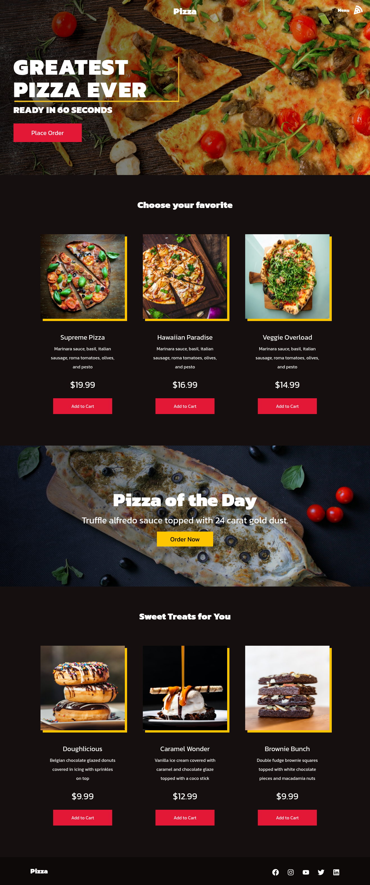

<h1 align="center">
 Pizza- Layout
</h1>


  <a href="#-tecnologias">Tecnologias</a>&nbsp;&nbsp;&nbsp;|&nbsp;&nbsp;&nbsp;
  <a href="#-projeto">Projeto</a>&nbsp;&nbsp;&nbsp;|&nbsp;&nbsp;&nbsp;
  <a href="#-como-executar">Como executar</a>&nbsp;&nbsp;&nbsp;
  
</p>


<p align="center">
  
</p>


## ✨ Tecnologias

Esse projeto foi desenvolvido com as seguintes tecnologias:

- [React](https://reactjs.org)


## 💻 Projeto

O Pizza-Layout é um modelo de website  .


## 🚀 Como executar

 Clonar o repositorio
```bash
$ git clone https://github.com/nicksoto1/react-pizza-website.git
```
Acessar o repertório:
```bash
$ cd react-pizza-website
```
 Instalar as dependências:
```bash
$ npm install
```

 Iniciar o projeto:
```bash
$ npm start
```                                                 
                                                    


Feito com 💙 by Brian Design https://www.youtube.com/watch?v=GlROncAX4XI&ab_channel=BrianDesign

## ✒️ Author

<a href="https://github.com/nicksoto1">
 
 <br />
 <sub><b>Michael Soto</b></sub></a> <a href="https://github.com/nicksoto1">🚀</a>
 <br />
